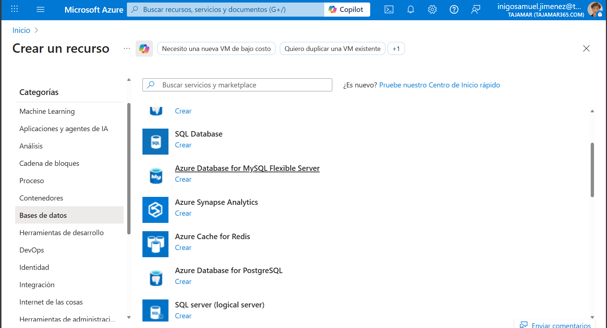
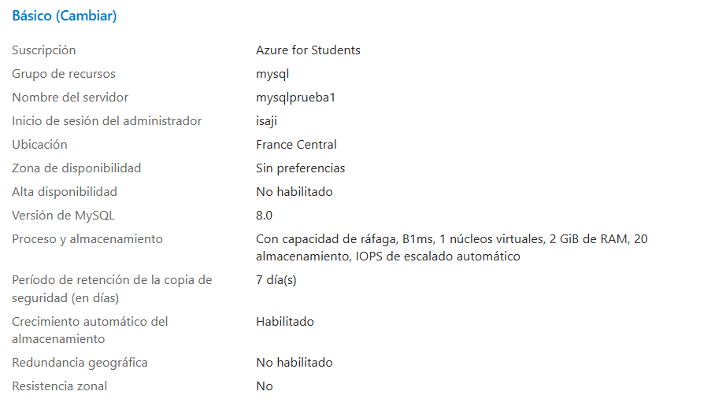
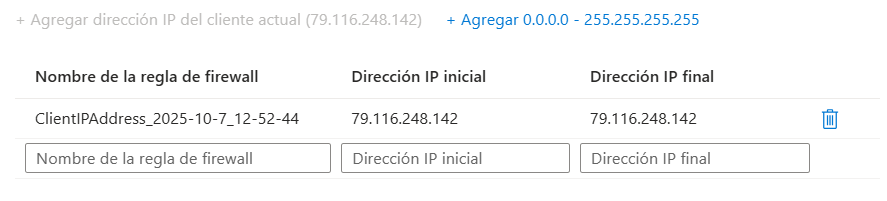
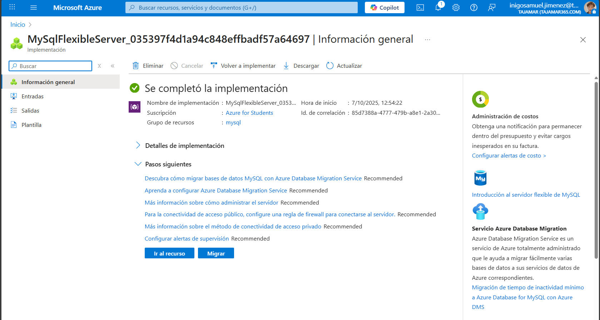

# Exploración de Azure Database for MySQL

En este laboratorio aprenderás a **crear y explorar un recurso de Azure Database for MySQL**.  
Configurarás el servicio desde el portal de Azure y revisarás las opciones básicas de implementación y administración.

**Duración estimada:** unos 5 minutos  
**Requisitos previos:** disponer de una suscripción de Azure con permisos administrativos.

---

## 1. Crear un recurso de Azure Database for MySQL

1. Accede al [Portal de Azure](https://portal.azure.com).  
2. En la esquina superior izquierda, selecciona **“+ Crear un recurso”**.  
3. Busca **“Azure Database for MySQL”** y selecciona **Crear**.  
4. En las opciones disponibles, elige **Servidor flexible** y haz clic en **Crear**.

**Captura 1 – Opciones de implementación de Azure Database for MySQL**  

---

## 2. Configuración del servidor

En la página **Crear base de datos MySQL**, completa los campos con los siguientes valores (deja el resto con sus valores predeterminados):

- **Suscripción:** tu suscripción actual  
- **Grupo de recursos:** crea uno nuevo con el nombre que prefieras  
- **Nombre del servidor:** elige un nombre único  
- **Región:** selecciona una ubicación cercana  
- **Versión de MySQL:** sin cambios  
- **Tipo de carga de trabajo:** para proyectos de desarrollo o aficiones  
- **Proceso y almacenamiento:** sin cambios  
- **Zona de disponibilidad:** sin cambios  
- **Alta disponibilidad:** sin cambios  
- **Nombre de usuario administrador:** tu nombre o identificador  
- **Contraseña y confirmación:** establece una contraseña segura  

A continuación, selecciona **Siguiente: Redes**.

**Captura 2 – Configuración básica del servidor MySQL**  

---

## 3. Configuración de red y seguridad

1. En la pestaña **Redes**, dentro de **Reglas de firewall**, selecciona **“+ Agregar dirección IP del cliente actual”** para permitir el acceso desde tu máquina local.  
2. Una vez agregada la dirección IP, haz clic en **Revisar y crear**.  
3. Finalmente, selecciona **Crear** para implementar el servidor MySQL.

**Captura 3 – Configuración de red y reglas de firewall**  

---

## 4. Verificación del recurso implementado

Cuando la implementación se complete, selecciona **Ir al recurso**.  
Deberías ver la página principal del servidor de **Azure Database for MySQL**, con las opciones disponibles de administración, conexión y supervisión.

**Captura 4 – Servidor MySQL implementado en Azure Portal**  

---

**Resumen:**  
Has creado un servidor **Azure Database for MySQL (Servidor flexible)**, configurado la red y revisado las opciones básicas de administración del servicio.  
Desde aquí puedes conectar clientes externos o herramientas como **MySQL Workbench** o **CLI de MySQL** para gestionar tus bases de datos y ejecutar consultas.
