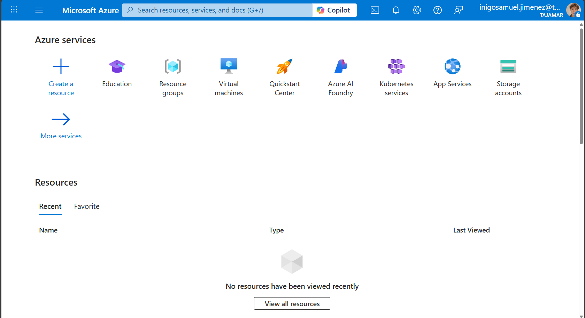
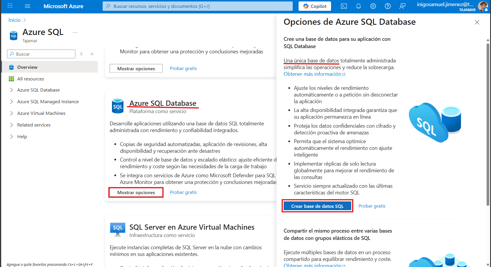
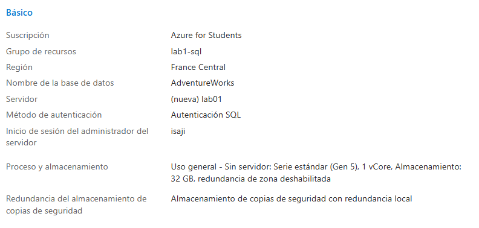
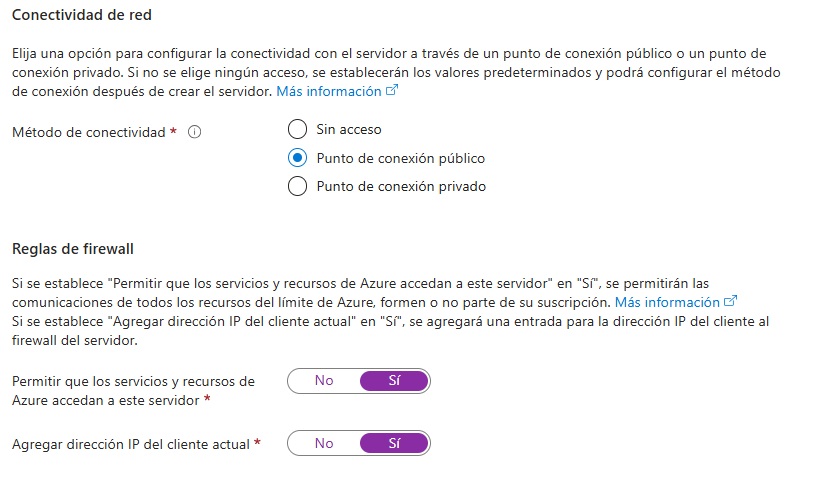
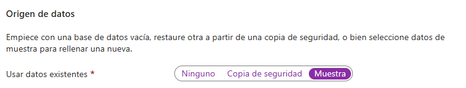
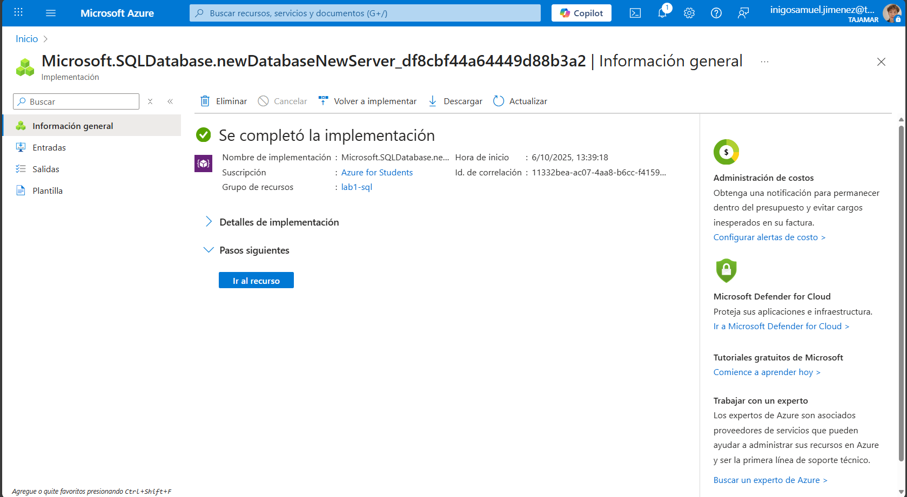
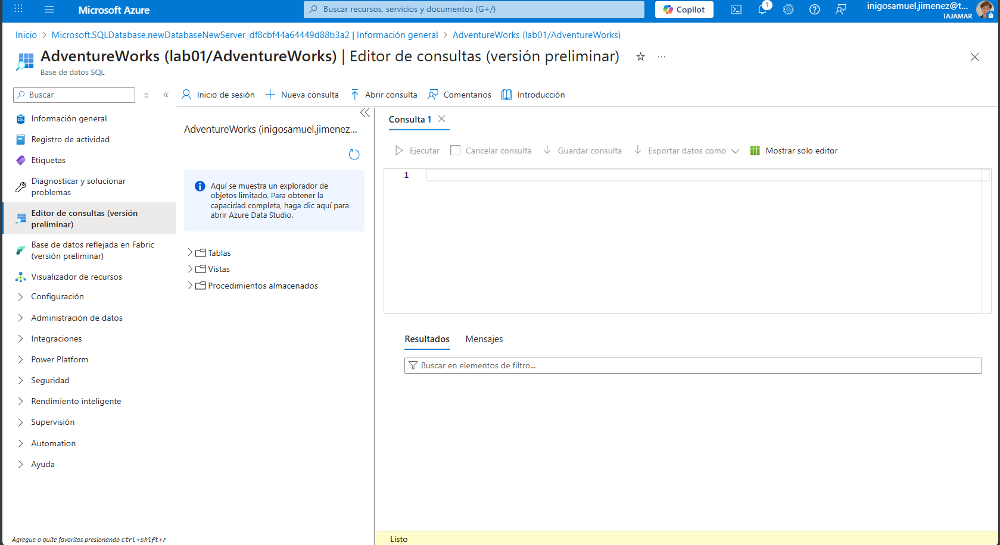
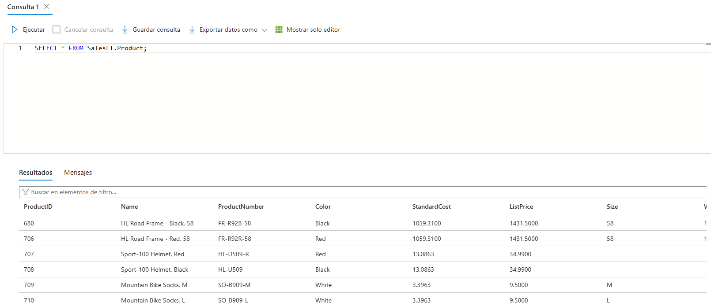
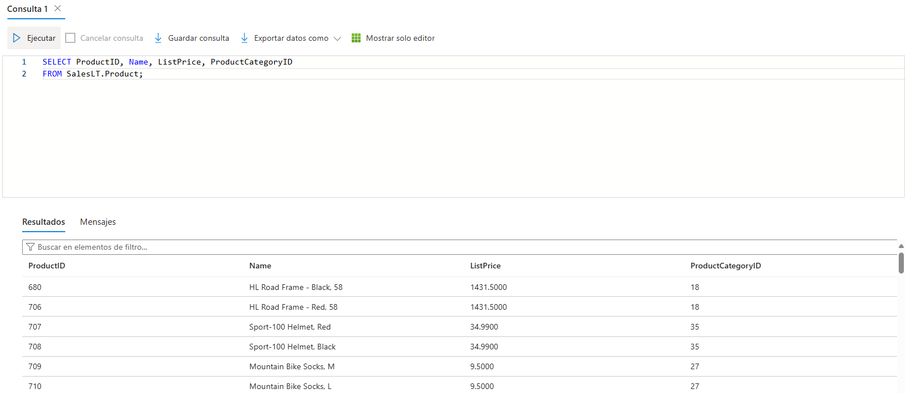
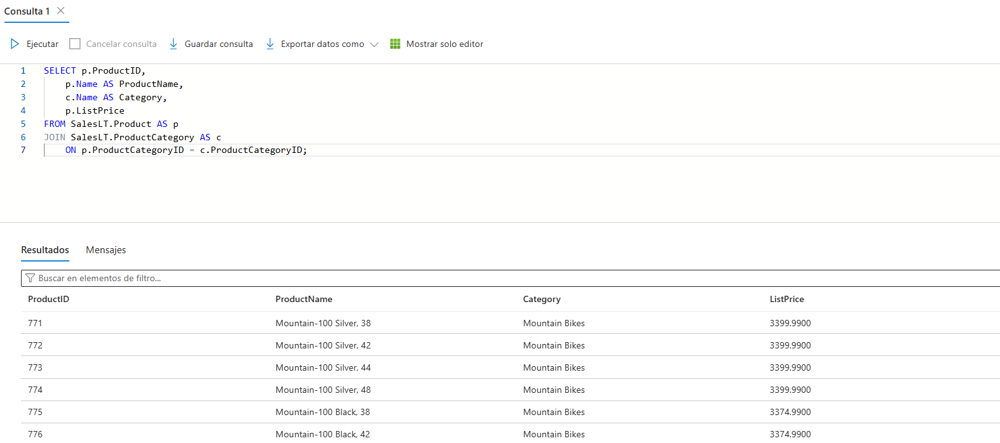

# Exploración de Azure SQL Database

En este laboratorio aprenderás a **crear y explorar una base de datos en Azure SQL Database**.  
Configurarás el recurso desde el portal de Azure y luego practicarás algunas consultas SQL sobre una base de datos de ejemplo.

**Duración estimada:** unos 15 minutos  
**Requisitos previos:** disponer de una suscripción de Azure con permisos administrativos.

---

## 1. Crear una base de datos en Azure SQL

1. Accede al [Portal de Azure](https://portal.azure.com).  
2. En la esquina superior izquierda, selecciona **“+ Crear un recurso”**.  
3. Busca **“Azure SQL”** y elige la opción **Crear**.  
4. En la página que se abre, selecciona **"Mostrar opciones"** y acto seguido asegúrate de seleccionar base de datos única.

**Captura 1 – Acceso al Portal de Azure**  


**Captura 2 – Creación del recurso Azure SQL**  


---

## 2. Configuración básica

En la pantalla **Crear base de datos SQL**, completa los campos como sigue (el resto puedes dejarlo por defecto):

- **Suscripción:** tu suscripción actual.  
- **Grupo de recursos:** crea uno nuevo con el nombre que prefieras.  
- **Nombre de base de datos:** `AdventureWorks`  
- **Servidor:** selecciona *Crear nuevo*  
  - Asigna un **nombre único**.  
  - Elige **cualquier región disponible**.  
  - Usa **autenticación SQL**.  
  - Define un **usuario administrador** (por ejemplo, tu nombre).  
  - Establece una **contraseña segura** y anótala.  
- **¿Usar grupo elástico de SQL?:** No  
- **Entorno de carga de trabajo:** Implementación (Desarrollo)  
- **Proceso y almacenamiento:** dejar sin cambios  
- **Redundancia de backups:** *Locally-redundant backup storage*

**Captura 3 – Configuración básica de la base de datos**  


---

## 3. Configurar red y seguridad

1. En la pestaña **Redes**, dentro de **Conectividad de red**, selecciona **Punto de conexión público**.  
2. Activa **Sí** en ambas opciones de **Reglas de firewall** para permitir acceso desde los servicios de Azure y tu IP actual.  
3. En la pestaña **Seguridad**, desactiva la opción **Microsoft Defender for SQL** (elige *Ahora no*).  
4. En **Configuración adicional**, activa la opción **Usar datos existentes: Ejemplo**.  
> [!NOTE]
> Esto creará automáticamente una base de datos de muestra con datos para practicar consultas.

5. Haz clic en **Revisar y crear**, y después en **Crear**.

**Captura 4 – Configuración de red y firewall**  


**Captura 5 – Configuración adicional**  


---

## 4. Acceder al recurso y abrir el editor SQL

Cuando la implementación finalice:

1. Abre el recurso recién creado.  
2. En el panel lateral, selecciona **Editor de consultas (versión preliminar)**.  
3. Inicia sesión con el usuario y contraseña que configuraste al crear el servidor.  

> [!NOTE] 
> Si te aparece un error indicando que tu dirección IP no está permitida, haz clic en el enlace **“Lista de direcciones IP permitidas”** del mensaje para añadir tu IP actual y vuelve a intentarlo.

**Captura 6 – Recurso SQL creado en el portal**  


**Captura 7 – Editor de consultas de Azure SQL**  


---

## 5. Consultar los datos

En el editor de consultas, expande la carpeta **Tablas** para ver las que contiene la base de datos.

Ejecuta las siguientes consultas:

### Ver todos los productos
```sql
SELECT * FROM SalesLT.Product;
```
Esto devolverá todas las columnas y filas de la tabla `SalesLT.Product`.

**Captura 8 – Resultado de la consulta completa**  


---

### Seleccionar columnas específicas
```sql
SELECT ProductID, Name, ListPrice, ProductCategoryID
FROM SalesLT.Product;
```
Muestra únicamente las columnas más relevantes del catálogo de productos.

**Captura 9 – Resultado de columnas seleccionadas**  


---

### Usar JOIN para combinar tablas
```sql
SELECT p.ProductID, 
	p.Name AS ProductName,
	c.Name AS Category, 
	p.ListPrice
FROM SalesLT.Product AS p
JOIN SalesLT.ProductCategory AS c
	ON p.ProductCategoryID = c.ProductCategoryID;
```
Con esta consulta puedes ver el nombre del producto junto con su categoría correspondiente.

**Captura 10 – Resultado de la consulta con JOIN**  


---

## 6. Cierre

Una vez realizadas las consultas, puedes cerrar el panel del editor de consultas.  
No es necesario guardar cambios, ya que solo has trabajado sobre datos de ejemplo.

---

**Resumen:**  
Has creado una base de datos Azure SQL, configurado su red y seguridad, y ejecutado tus primeras consultas SQL sobre un dataset de muestra.  
Este flujo es muy parecido al que seguirías para conectar tus propias aplicaciones a un servicio SQL en Azure.
